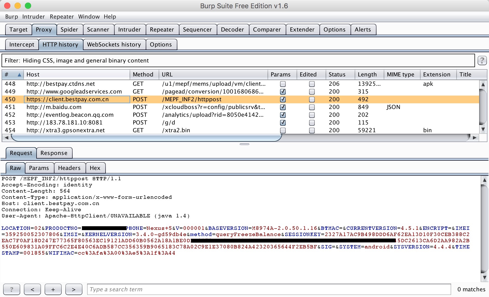

# SSLKiller

SSLKiller is used for Killing SSL verification functions on **Android** client side. With SSLKiller, You can intercept app's **HTTPS** communication packages between the client and server. This project is very helpful for those who wants to analysis the network communications in android apps but with HTTPS deployment.

This project is build as a Xposed module. Before using it, you have to install **[Xposed](http://repo.xposed.info/module/de.robv.android.xposed.installer)** on your Android device first!

Burp Suit can help us to deploy a MITM and intercept transparent http packages. When meets https transaction, burp uses a fake server cert to communicate with the client, if app has a uncorrect cert verification process (e.g. an empty TrustManager implementation) the https packages can be intercepted by burp but if app do the right verification, burp will alert connection failed. SSLKiller can fix this problem and let all https transaction of the app displayed in burp.

